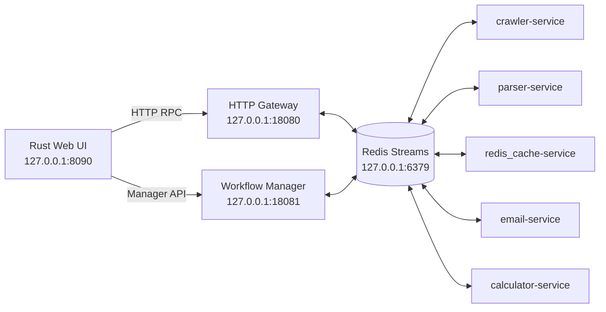

# 🚦 WebSupervisor-microservice-v2

> 基于 **Redis Streams** 的 Go 微服务通信框架、网页监控编排器与可视化控制台。
> 让服务通过消息解耦，让任务通过 JSON 编排，让运行状态在一个界面里可见、可控、可追踪。

[](https://go.dev/)
[](https://www.rust-lang.org/)
[](https://redis.io/docs/latest/develop/data-types/streams/)
[](#快速开始)

## 🧭 这是什么？

WebSupervisor 是一个面向本地部署的微服务实验与网页监控平台，包含三层能力：

| 层级 | 组件 | 解决的问题 |
|---|---|---|
| **通信层** | `MyTool/stream` + Redis Streams | 微服务之间如何可靠地发送请求、响应和大消息 |
| **业务层** | crawler、parser、cache、email、workflow-manager 等 Go 服务 | 如何把抓取、解析、比较、通知组合成可复用能力 |
| **控制层** | `web-ui-service` Rust 控制台 | 如何启动/停止/接管服务，并观察抓取、工作流和增量文档 |

它适合用于：

- 学习 Redis Streams、消费者组和请求-响应式 RPC；
- 快速搭建抓取 → 解析 → 缓存比较 → 邮件通知链路；
- 通过 JSON workflow 定时轮询网页或 API，并生成 JSON/Markdown 文档；
- 在本地 GUI 中统一管理多个 Go 微服务。

> **想先跑起来？** 直接跳到 [快速开始](#快速开始)。
> **想先了解工作流？** 阅读 [Workflow Manager 与增量文档](#workflow-manager-与增量文档)。

## ✨ 核心能力

- **消息驱动 RPC**：服务之间不直接耦合，通过 Redis Stream 传递请求和响应。
- **大消息分片**：超过 `max_message_bytes` 的请求或响应自动分片、重组。
- **超时与并发控制**：支持 deadline、handler 并发上限和消费者组。
- **可视化运维**：GUI 支持服务启动、停止、重启、日志、配置、外部进程接管。
- **网页监控编排**：按间隔或 cron 轮询执行 JSON jobs。
- **增量文档**：根据对象身份字段和比较字段生成新增、修改、删除 Diff。
- **安全配置分层**：支持 `config.local.json`、`.env` 和环境变量，避免把本地密钥提交到仓库。

## 🗺️ 目录导航

| 你想做什么 | 推荐入口 |
|---|---|
| 了解消息库和微服务模板 | [`MyTool/stream`](MyTool/stream/) |
| 启动并管理所有本地服务 | [`web-ui-service/README.md`](microservice/web-ui-service/README.md) |
| 编写定时轮询和增量文档任务 | [`WORKFLOW_GUIDE.md`](microservice/web_supervisor-manager/WORKFLOW_GUIDE.md) |
| 查看 Workflow Manager 说明 | [`web_supervisor-manager/README.md`](microservice/web_supervisor-manager/README.md) |
| 调试 Redis Stream | [`MyTool/streams-manager`](MyTool/streams-manager/) |
| 查看抓取、解析、缓存和邮件示例 | [示例微服务一览](#示例微服务一览) |

## 🏗️ 系统架构



### 一次 Redis RPC 的生命周期

1. 调用方执行 `stream.Send(targetStream, serviceName, payload, timeout)`，生成唯一 `message_id` 并写入目标 Stream。
2. 目标服务的消费者组读取消息，按 `service_name` 分发到已注册的 handler。
3. handler 调用 `stream.ResponseSucc` 或 `stream.ResponseErr`，响应写回 `callback_stream`。
4. 调用方按 `reply_id` 取回响应；消息处理完成后执行 `XAck + XDel`。

### 通信层的关键机制

| 机制 | 说明 |
|---|---|
| 请求-响应 RPC | 请求携带 `message_id`、`callback_stream` 和 deadline，响应通过 `reply_id` 关联。 |
| 消费者组 | 每个服务监听自己的 Stream；未确认消息会保留在 PEL 中，支持至少一次消费。 |
| 大消息分片 | 请求和响应都支持按字节分片，接收端由 `ShardManager` 重组。 |
| 超时丢弃 | 消费端发现消息已过期时直接确认并删除，避免执行过期任务。 |
| 并发控制 | `goroutine_num` 限制业务 handler 并发数；内置 `ping` 不占用业务信号量。 |
| 配置展开 | 配置中的字符串支持 `${ENV_NAME}` 环境变量展开，业务配置可放在 `custom` 中。 |

## 📦 目录结构

<details>
<summary>展开项目结构</summary>

```text
WebSupervisor-microservice-v2/
├── MyTool/                         # 公共工具库（module: github.com/totooicu/go-mytool）
│   ├── stream/                     # Redis Streams 微服务通信库
│   ├── streamtool/                 # 早期通信工具包（保留作参考）
│   ├── streams-manager/            # Redis Stream CLI 管理/调试工具
│   ├── http/                       # HTTP 客户端、HTML/XPath/JSON 解析器
│   └── redis/ config/ email/ ...   # Redis、文件、集合、加密等通用工具
├── microservice/
│   ├── calculator-service/         # 最小计算示例
│   ├── crawler-service/            # HTTP 抓取
│   ├── parser-service/             # HTML/XPath/JSON 解析
│   ├── redis_cache-service/        # 缓存与变更比较
│   ├── email-service/              # SMTP 邮件
│   ├── web_supervisor-manager/     # 网页监控与 Workflow Manager
│   ├── http-gateway-service/       # HTTP → Redis Streams 网关
│   ├── web-ui-service/             # Rust 浏览器/桌面控制台
│   ├── microservice-manager/       # 服务调用示例客户端
│   ├── build_web_supervisor.bat    # Go 服务批量构建
│   └── run_web_supervisor.bat      # 旧版批量启动脚本
├── go.work                         # 聚合多个 Go module
├── go.mod
└── .env.example                    # 安全的环境变量模板
```

</details>

## 🚀 快速开始

### 前置条件

| 依赖 | 要求 |
|---|---|
| 操作系统 | Windows 10/11；Linux 可运行 Go 服务，桌面模式需要 Windows WebView2 |
| Redis | 默认 `localhost:6379` |
| Go | 1.25+，用于编译 Go 微服务 |
| Rust | stable toolchain + Cargo，用于编译控制台 |

### 推荐启动流程（Windows 浏览器模式）

```powershell
# 1. 在仓库根目录执行
cd .\microservice
.\build_web_supervisor.bat

# 2. 启动 Rust 控制台的浏览器模式
cd .\web-ui-service
cargo run --release -- --web -config_path .\config.json
```

打开浏览器访问 **<http://127.0.0.1:8090>**，然后在控制台中启动需要的服务。

> `build_web_supervisor.bat` 会构建 crawler、parser、redis_cache、email、http-gateway 和 web_supervisor-manager 的 Windows/Linux/ARM64 目标，并将产物放入 `microservice/bin/`。
> `calculator-service` 是独立示例，需要在自己的目录单独编译。

### 控制台的其它启动方式

| 模式 | 命令 | 说明 |
|---|---|---|
| 浏览器开发模式 | `cargo run --release -- --web -config_path .\config.json` | 推荐；启动后访问 `:8090` |
| 桌面模式 | `cargo run --release -- -config_path .\config.json` | Windows 需要 WebView2 Runtime |
| 已编译浏览器模式 | `cargo build --release` 后执行 `target\release\web-ui-service.exe ... --web` | 适合发布或重复启动 |
| 旧版脚本 | `run_web_supervisor.bat` | 依赖各服务目录已有可执行文件，不如 GUI 直观 |

### 默认地址

| 组件 | 地址 | 作用 |
|---|---|---|
| Redis | `localhost:6379` | Stream 消息、消费者组和缓存 |
| HTTP Gateway | `http://127.0.0.1:18080` | 将 HTTP RPC 转发到 Redis Streams |
| Workflow Manager | `http://127.0.0.1:18081` | 轮询 workflow、保存文档与生成 Diff |
| Rust Web UI | `http://127.0.0.1:8090` | 服务控制、抓取、RPC 和工作流管理 |

## 🧩 示例微服务一览

| 服务 | 默认 Stream | 对外服务 | 用途 |
|---|---|---|---|
| [calculator-service](microservice/calculator-service/README.md) | `dev:calculator-stream` | `add`、`divide` | 最小调用示例：求和、除法 |
| [crawler-service](microservice/crawler-service/README.md) | `dev:crawler-stream` | `http_request` | HTTP 请求、页面抓取和状态码返回 |
| [parser-service](microservice/parser-service/README.md) | `dev:parser-stream` | `parse_html_by_get_mid`、`parse_html_by_xpath`、`parse_json` | 从 HTML/JSON 文本提取数据 |
| [redis_cache-service](microservice/redis_cache-service/README.md) | `dev:redis_cache-stream` | `compare_and_save`、`get`、`set`、`delete`、`get_and_set` | 缓存读写与变化检测 |
| [email-service](microservice/email-service/README.md) | `dev:email-stream` | `email_by_config`、`email_by_custom` | SMTP 邮件发送，支持 QQ 邮箱 465/587 |
| [web_supervisor-manager](microservice/web_supervisor-manager/README.md) | `dev:web_supervisor-stream` | 编排器 | 执行抓取、解析、比较和通知任务 |
| [microservice-manager](microservice/microservice-manager/README.md) | `dev:client-stream` | 客户端示例 | 演示如何调用其它服务 |

典型网页监控链路：

```text
web_supervisor-manager
   │
   ├─ ① http_request ────────> crawler-service
   │                             返回 content / status
   ├─ ② parse_html / parse_json -> parser-service
   │                             返回 parsed_data
   ├─ ③ compare_and_save ─────> redis_cache-service
   │                             返回 changed
   └─ ④ email_by_config ──────> email-service（有变化时通知）
```

## 🖥️ Rust 控制台

`microservice/web-ui-service` 提供浏览器模式和原生 WebView 桌面模式，用一个界面管理本地服务与工作流。

### 功能清单

- 查看服务在线状态、健康详情、PID 和管理状态；
- 启动、停止、重启单个服务或批量操作多个服务；
- 接管已在控制台外运行的唯一匹配进程；
- 查看 stdout/stderr 日志并清理 GUI 保存的日志；
- 调用 crawler-service 抓取网页，查看最近结果和 JSONL 历史；
- 通过 Gateway 调用任意 Redis Streams 服务进行 RPC 调试；
- 创建、编辑、启用/暂停和立即运行 Workflow Manager 任务；
- 查看 JSON/Markdown 文档、Diff、快照和运行记录。

### 服务在线判断与接管规则

- crawler、parser、redis_cache、email、calculator、http-gateway：GUI 通过 Gateway 对其 Stream 发送 `ping`；
- `workflow-manager`：GUI 使用 `GET {manager_addr}/health`，因为它是独立 HTTP 服务，不是 Gateway 的 Redis RPC 服务；
- `启动`：GUI 创建并管理进程，状态通常为 `running`；
- `接管`：GUI 按配置中的可执行文件名寻找外部进程，只有唯一匹配 PID 才允许接管，状态为 `adopted`；
- GUI 关闭时会停止由 GUI 启动或接管的进程。

> 如果希望 Workflow Manager 在关闭 GUI 后继续轮询，请独立启动 Manager，并在 GUI 中不要点击“启动”或“接管”。
>
> 更多配置、API 和排障信息见 [`microservice/web-ui-service/README.md`](microservice/web-ui-service/README.md)。

### 常用控制台 API

| 方法 | 路径 | 用途 |
|---|---|---|
| `GET` | `/` | 内置控制台页面 |
| `GET` | `/api/services` | 获取服务状态与健康详情 |
| `POST` | `/api/services/start-all` | 启动所有已配置服务 |
| `POST` | `/api/services/stop-all` | 停止所有 GUI 管理的服务 |
| `POST` | `/api/services/:name/start` | 启动单个服务 |
| `POST` | `/api/services/:name/adopt` | 接管外部运行中的唯一匹配进程 |
| `GET/PUT` | `/api/services/:name/config` | 读取或保存服务配置 |
| `GET` | `/api/services/:name/logs` | 读取服务日志 |
| `POST` | `/api/crawl` | 调用 crawler-service 抓取网页 |
| `POST` | `/api/rpc` | 调用任意 Redis Streams RPC |
| `GET/POST/PUT/DELETE` | `/api/manager/...` | 代理 Workflow Manager API |

## 🔁 Workflow Manager 与增量文档

Workflow Manager 按任务的 `schedule` 轮询执行 `workflow.jobs`，将结果保存为 JSON/Markdown，并按照对象身份和比较字段生成增量 Diff。

完整字段、服务语义和 API 见 [`microservice/web_supervisor-manager/WORKFLOW_GUIDE.md`](microservice/web_supervisor-manager/WORKFLOW_GUIDE.md)。

### 最小任务示例

```json
{
  "name": "公告监控",
  "enabled": true,
  "schedule": { "interval_seconds": 120 },
  "workflow": {
    "jobs": [
      {
        "stream": "dev:crawler-stream",
        "service": "http_request",
        "payload": { "url": "https://example.com/data.json", "method": "GET" },
        "resultto": "response"
      },
      {
        "stream": "",
        "service": "get",
        "payload": { "path": "response.content", "default": "" },
        "resultto": "content"
      }
    ]
  },
  "document": {
    "source": "content",
    "directory": "documents/announcements",
    "identity": "id",
    "compare": ["id", "title", "updated_at"]
  }
}
```

### 变量、内置服务与操作符

| 语法/服务 | 作用 |
|---|---|
| `${NAME}` | 读取系统环境变量；严格模式下变量不存在会报错 |
| `#{path.to.value}` | 读取 Workflow Manager 配置中的 `custom` 全局变量 |
| `%{path.to.value}` | 读取当前 workflow 的局部变量 |
| `get` | 从当前 map 或结果中按路径取值，可设置默认值 |
| `set` | 向当前 map 写入一个值 |
| `func` | 在隔离的子 map 中执行一组 jobs，并按 `returnto` 返回结果 |
| `execfunc` | 调用已定义函数并传入参数 |
| `if` / `while` | 条件分支与条件循环 |
| `operators` | `+ - * / % len`，以及 `== != > >= < <= && || !` |

> Workflow 的历史字段名使用 `playload`（而不是 `payload`）表示请求负载；编写底层 `StreamMessage` 或兼容既有服务时请保持该拼写。HTTP workflow 示例中的服务参数仍按各服务 API 使用 `payload`。

### 轮询、baseline 与 Diff

- `interval_seconds` 最小为 30 秒，也支持五段 cron 表达式；手动 `run` 会绕过轮询间隔限制；
- 第一次成功运行建立 baseline；后续运行依据 `identity` 匹配对象；
- `compare` 字段用于识别对象是否发生变化，输出新增、修改、删除 Diff；
- JSON、Markdown、baseline 和 snapshot 默认写入 `data/workflow-manager/documents/`；
- SQLite 状态库默认为 `manager.db`。

### Manager API

| 方法 | 路径 | 用途 |
|---|---|---|
| `GET` | `/health` | 健康检查 |
| `GET/POST/PUT/DELETE` | `/api/v1/tasks` | 任务增删改查 |
| `POST` | `/api/v1/tasks/:id/run` | 立即执行任务 |
| `POST` | `/api/v1/tasks/:id/pause`、`resume` | 暂停/恢复轮询 |
| `GET` | `/api/v1/tasks/:id/document`、`diff`、`snapshots` | 查看文档、Diff 和快照 |
| `POST` | `/api/v1/workflow/validate`、`dry-run` | 校验或试运行 workflow |
| `GET` | `/api/v1/events` | SSE 运行事件流 |

默认地址：`http://127.0.0.1:18081`。GUI 通过 `/api/manager/...` 代理这些接口。

## 🛠️ 用 `MyTool/stream` 构建微服务

### 1. 注册 module

在 `go.work` 中加入新目录，在新目录执行 `go mod init` 和 `go mod tidy`，并依赖：

```text
github.com/totooicu/go-mytool/stream
```

### 2. 准备 `config.json`

```json
{
  "redis": {
    "addr": "localhost:6379",
    "password": "",
    "db": 0
  },
  "stream": {
    "consumer_stream": "dev:my-stream",
    "consumer_group": "my-group",
    "goroutine_num": 5,
    "get_timeout_ms": 5000,
    "max_message_bytes": 204800,
    "cache_key_prefix": "my:"
  },
  "custom": {
    "downstream_stream": "dev:other-stream"
  }
}
```

常用字段：

| 配置块 | 字段 | 说明 |
|---|---|---|
| `redis` | `addr` / `password` / `db` | Redis 地址、密码和逻辑库 |
| `stream` | `consumer_stream` | 本服务监听的 Stream，也是服务身份 |
| `stream` | `consumer_group` | Redis 消费者组名称 |
| `stream` | `goroutine_num` | 业务 handler 最大并发数 |
| `stream` | `get_timeout_ms` | `stream.Send` 默认等待时间（毫秒） |
| `stream` | `max_message_bytes` | 超过此大小自动分片，缺省约 1 MB |
| `stream` | `cache_key_prefix` | `CacheSet/CacheGet` 的 key 前缀 |
| `custom` | 自定义字段 | 业务配置，可通过 `stream.Custom` 读取 |

### 3. 编写 handler 并注册服务

```go
package main

import (
    "log"
    "os"
    "os/signal"
    "syscall"

    "github.com/totooicu/go-mytool/stream"
)

func main() {
    if err := stream.LoadConfig("config.json"); err != nil {
        log.Fatal("load config error:", err)
    }
    if err := stream.Init(); err != nil {
        log.Fatal("stream init error:", err)
    }

    stream.RegisterService("hello", handleHello)
    log.Println("my service started")

    quit := make(chan os.Signal, 1)
    signal.Notify(quit, syscall.SIGINT, syscall.SIGTERM)
    <-quit
}

func handleHello(msg *stream.StreamMessage) {
    name, _ := msg.Playload["name"].(string)
    if name == "" {
        stream.ResponseErr(msg, "name is required")
        return
    }
    stream.ResponseSucc(msg, map[string]interface{}{
        "greeting": "hello " + name,
    })
}
```

### 调用服务与健康检查

```go
resp, err := stream.Send(
    "dev:my-stream",
    "hello",
    map[string]interface{}{"name": "world"},
    5000,
)
if err != nil {
    log.Println("request failed:", err)
}

stat, err := stream.SendPing("dev:my-stream")
if err == nil {
    log.Println(stat.Playload)
}
```

> `StreamMessage` 中的业务字段拼写是历史兼容字段 `playload`。内置 `ping` 和 `response` 会由通信库自动注册。

### `StreamMessage` 常用字段

| 字段 | 说明 |
|---|---|
| `message_id` | 全局唯一消息 ID |
| `reply_id` | 响应关联的请求 ID |
| `service_name` | 目标服务名；响应固定为 `response` |
| `callback_stream` | 响应回发的 Stream |
| `source_stream` / `source_service` | 请求来源 |
| `playload` | 业务数据，通常为 `map[string]interface{}` |
| `sharding_id` / `sharding_total` / `sharding_data` | 分片信息 |
| `err_code` / `err_msg` | 错误码与错误消息 |
| `deadline` | 绝对过期时间戳（毫秒） |
| `trace_id` | 链路追踪 ID |

## ⚙️ 配置与安全

### 配置优先级

推荐把 Git 跟踪的 `config.json` 当作无个人信息的默认模板，把本地覆盖写入同目录的 `config.local.json`。Rust 控制台会优先读取本地覆盖文件，运行数据和日志放在 `data/` 中。

敏感值优先放入仓库根目录的 `.env` 或系统环境变量。仓库提供安全模板 [`.env.example`](.env.example)：

```powershell
$env:QQ_MAIL_ACCOUNT_1134 = "你的发件邮箱"
$env:QQ_MAIL_PASSWORD_1134 = "邮箱 SMTP 授权码"
$env:QQ_MAIL_ACCOUNT_2667 = "通知收件邮箱"
```

注意：

- QQ 邮箱配置中的 `password` 应填写 SMTP 授权码，不是登录密码；
- 不要提交 `config.local.json`、`.env`、真实密码、SMTP 授权码或个人收件人；
- 如果误改了已跟踪的默认配置，请先把本地值迁移到 `config.local.json`，再使用 `git restore -- <file>` 恢复默认文件；
- 直接启动 Go 服务时，需要先把环境变量注入当前进程；由 GUI 启动时，GUI 会加载 `.env` 并传递给子进程。

## 🧪 构建与测试

### 构建 Go 服务

```powershell
cd .\microservice
.\build_web_supervisor.bat
```

### 单独构建 calculator 示例

```powershell
cd .\microservice\calculator-service
go build -o ..\bin\calculator-service\calculator-service_windows_amd64.exe .
```

### 检查 Rust 控制台

```powershell
cd .\microservice\web-ui-service
cargo fmt -- --check
cargo check
cargo test
cargo build --release
```

### 检查 Go 模块

在具体服务目录执行：

```powershell
cd .\microservice\web_supervisor-manager
go test ./...
go vet ./...
```

## 🧯 常见问题排查

### Redis 连接失败

确认 Redis 已启动并监听 `localhost:6379`，然后检查各服务配置中的 `redis.addr`、密码和 DB 编号。

### 端口被占用

默认端口如下：

- Gateway：`18080`
- Workflow Manager：`18081`
- Rust Web UI：`8090`

修改端口后，需要同步更新 `web-ui-service/config.json` 中的 `gateway_addr`、`manager_addr`、`listen_addr`，以及相关服务的 HTTP 配置。

### GUI 显示 Workflow Manager 离线或无法接管

Workflow Manager 应通过 HTTP 健康检查，而不是 Gateway 的 Redis `ping` 判断：

```powershell
curl.exe -i http://127.0.0.1:18081/health
curl.exe -i http://127.0.0.1:8090/api/services
curl.exe -i -X POST http://127.0.0.1:8090/api/services/workflow-manager/adopt
```

如果 `/health` 返回 `200` 但 GUI 仍显示旧状态，请重新编译并重启 `web-ui-service`。接管要求配置中的可执行文件名只能匹配一个外部进程。

### Gateway 返回 `504 request timeout`

普通 Go 服务的 `ping` 可以通过 Gateway 检查；`workflow-manager` 是独立 HTTP 服务，应该检查 `http://127.0.0.1:18081/health`，不要把 `local:workflow-manager` 当作 Gateway RPC Stream。

### Windows 无法覆盖 `.exe`

通常是旧服务进程仍在运行并锁定了二进制文件。先在 GUI 中停止服务，或确认对应进程已退出，再重新构建、切换分支或合并代码。

## 🔧 调试工具与进一步阅读

- [`MyTool/streams-manager`](MyTool/streams-manager/)：查看、添加、删除 Stream 与消息；
- [`microservice/web-ui-service/README.md`](microservice/web-ui-service/README.md)：GUI 配置、HTTP API、进程生命周期和接管细节；
- [`microservice/web_supervisor-manager/WORKFLOW_GUIDE.md`](microservice/web_supervisor-manager/WORKFLOW_GUIDE.md)：完整 workflow 字段、内置服务、变量和 Diff 语义；
- 各微服务目录下的 README：接口清单、请求/响应结构和 `custom` 配置说明。

提交前建议执行：

```powershell
git status --short
git diff --check
```

---

<div align="center">

**让微服务专注业务，让 Redis Streams 负责连接，让 GUI 负责掌控。**

</div>
